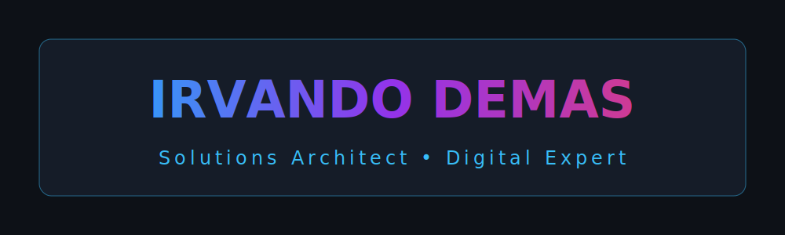

#  Hi there, I'm Irvan! 

  

  

---

## 🚀 Professional Overview
Saya adalah seorang profesional yang fokus pada **pembangun solusi digital yang andal**, mulai dari sistem manajemen perusahaan skala enterprise hingga aplikasi klien yang spesifik. Dengan pengalaman mendalam dalam mengelola **infrastruktur web, pointing domain, dan deployment server**, saya menjembatani kompleksitas teknis dengan kebutuhan bisnis yang nyata.

- 💼 **Current Activity**: Mengelola berbagai proyek strategis (Enterprise App, Management Systems, Corporate Profiles).
- 🛠️ **Deep Focus**: Arsitektur web, integrasi database, server management (VPS, Domain Pointing, SSL).
- 🌱 **Learning Path**: Mengeksplorasi teknologi Cloud terbaru dan optimasi performa aplikasi tingkat tinggi.
- ⚡ **Unique Value**: Saya terbiasa mengelola **puluhan domain klien** sekaligus dalam satu server produksi yang stabil!

---

## 💻 Technical Ecosystem

  <table width="100%">
    <tr>
      <td width="33%" align="center"><b>Languages & Frameworks</b></td>
      <td width="33%" align="center"><b>Database & Server</b></td>
      <td width="34%" align="center"><b>Tools & DevOps</b></td>
    </tr>
    <tr>
      <td align="center">
        
         
        
         
        
        
      </td>
      <td align="center">
        
         
        
         
        
      </td>
      <td align="center">
        
         
        
        
      </td>
    </tr>
  </table>

---

## 📈 Activity & Insights (Real-Time)

  

  
  

  

---

## 📬 Connect & Collaborate
Mari berkolaborasi untuk membangun solusi digital yang berdampak luas.

  <i>Semoga harimu menyenangkan! Jangan ragu untuk menghubungi saya untuk kolaborasi teknis maupun strategis.</i> 
  Managed with 💙 by Irvando Demas

